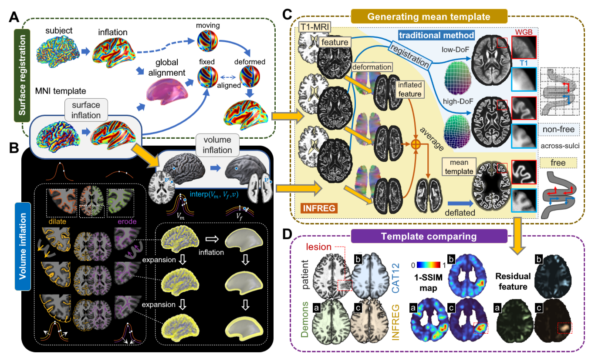

# INFREG: Volume‑Inflation Registration for Human Focal Cortical Dysplasia Detection

**INFREG** (Volume‑Inflation Registration) is a novel brain image registration method designed to improve the detection of focal cortical dysplasia (FCD). By integrating surface‑based deformation with volumetric alignment, INFREG minimises sulcal smoothing artefacts that typically confound voxel‑based morphometry (VBM), especially in highly folded association cortices.

---

## 🔬 Background

Neurodevelopmental expansion of human association cortex increases cortical folding complexity, causing registration inaccuracies that obscure subtle pathological signatures such as FCD in conventional VBM. INFREG addresses this by introducing a volume‑inflation strategy that preserves cortical topology while optimising volumetric correspondence.

---

## 🧠 Method Overview

INFREG operates through three main steps:

1. **Surface‑volume joint deformation** – surface‑driven constraints are embedded into the volumetric registration to prevent over‑smoothing of sulci.
2. **Sharp template construction** – a group template is built with preserved gyral details and reduced intensity variance.
3. **Statistical clustering** – abnormality maps are generated and clustered to identify candidate FCD lesions.

  
*Figure 1: Schematic of the INFREG registration pipeline.*

---

## 📊 Key Results

Validation was performed on **80 histologically confirmed FCD cases** and **85 healthy controls**. INFREG was compared against conventional methods (CAT12, Demons, BrainSuite).

| Metric | INFREG | Conventional (CAT12/Demons/BrainSuite) | p‑value |
| :--- | :--- | :--- | :--- |
| **Template‑to‑subject SSIM** | **0.95 ± 0.04** | 0.70 – 0.87 | < 0.001 |
| **GM/WM Dice coefficient** | **0.93 ± 0.05** | 0.70 – 0.87 | < 0.001 |
| **Template intensity SD** | **23–41% lower** | – | – |
| **Gyral alignment (mm)** | **3.34 ± 0.13** | 3.45 ± 0.15 | < 0.01 |
| **False‑positive FCD Type II clusters in association cortices** | **70–88% reduction** | – | < 0.001 |
| **Manual verification time – Observer 1 (s)** | **101 ± 67** | 177 ± 114 | < 0.001 |
| **Manual verification time – Observer 2 (s)** | **75 ± 48** | 162 ± 102 | < 0.001 |

Additional findings:
- In 30 typical cases, **90% of lesions were localised within the top 5 clusters**.
- All **12 VBM‑indeterminate cases** were successfully resolved by INFREG.

---

---

## 📄 License

This project is distributed under the **MIT License**. See the [LICENSE](LICENSE) file for details.

---

## 🙋 Contact

For questions or collaboration, please open an [issue](https://github.com/ifsunrise/brain-inflate-registration/issues) or email: zys_orz@163.com

---

*Last updated: July 2026*